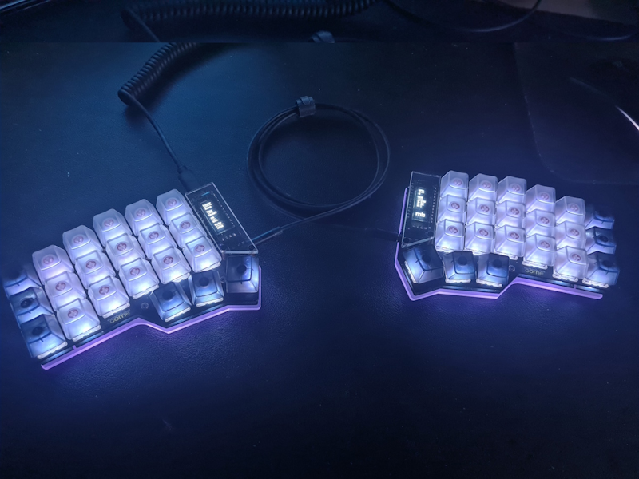
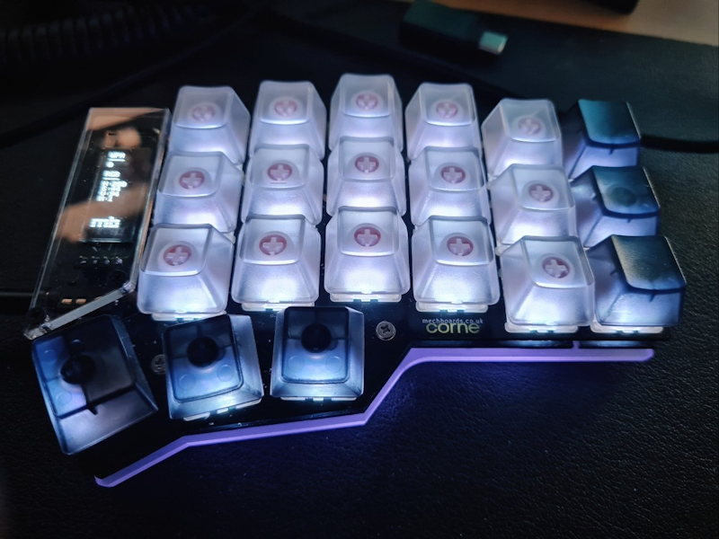
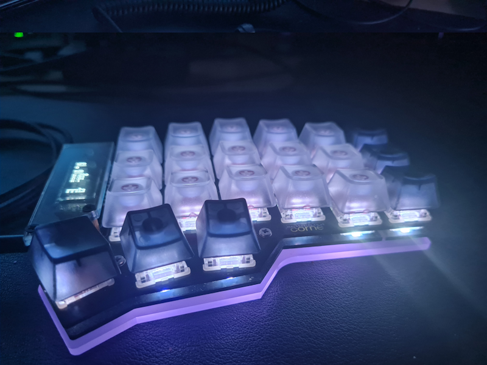
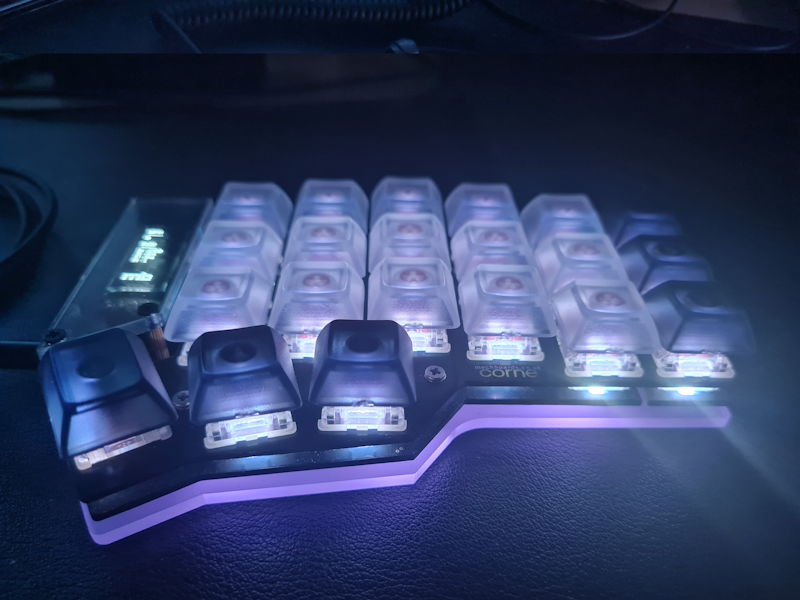
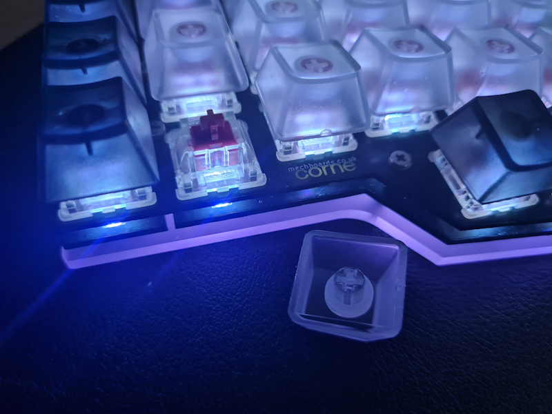
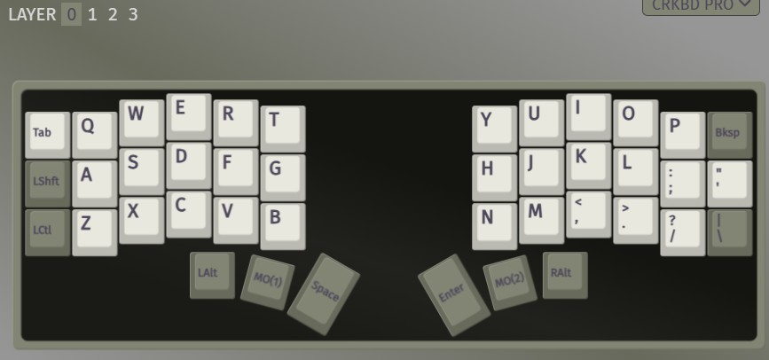
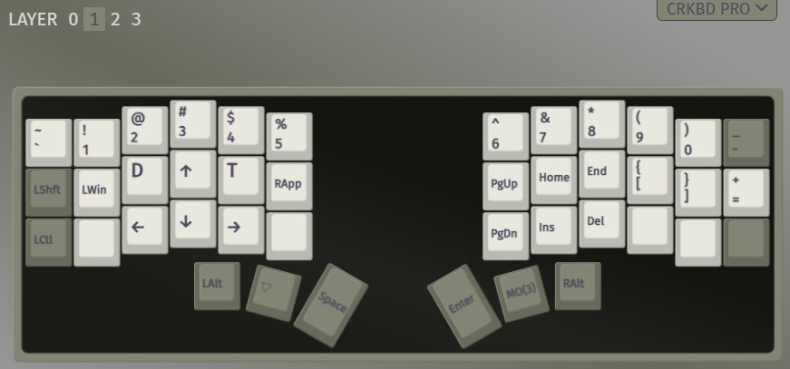
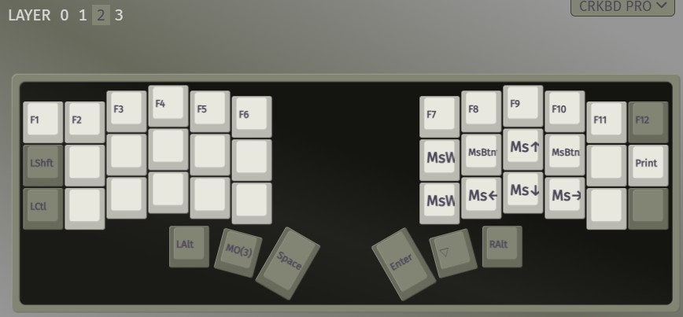
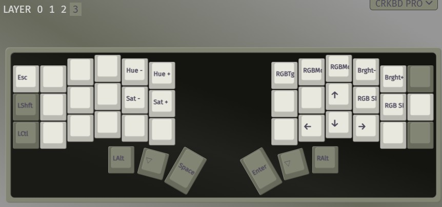

# Crkbd

Corne MAX (Helidox), 3x6. - [keymap Configuration (Via app)](/crkbd_pro.layout.json)
 

## Showcase

**All wired**

OEM Profile keycaps. Black/Frost Keycaps.<br>
No Wireless. USB Coiled cable is just better in my opinion. <br>

<br>

**Right side with natural lightning**.

OEM Profile keycaps. Black/Frost Keycaps.

<br>

___

**OEM Profile keycaps. Black/Frost Keycaps.**

You can clearly see the slopped, this will feel very natural. <br>
Even thumb keys will have slopped for the direction of the key press.<br>

<br>

___

**DSA Keycaps. Black/Frost Keycaps.**

No slop. Flat keycap is not terrible, many prefer flat keycaps. 

<br>


**Switch, Keycap o-ring 2x damper on keycap post.**

<br>


## Parts configurations

```
Switch: CHERRY MX2A RGB Silent, Red Linear Plate Mount.
Keycaps: OEM Profile Keycaps with x2 damper rings in keycap post.
```
___


```
Coming from Leopold fc660c, key weight and key-press touch to the base plate was very 
important for me.

There are many choices for the keycaps however there are mainly two catergory; 
flat or slopped. Flat keycaps for e.g. DSA, or XDA which are well-known and loved by 
many or you could go with slopped keycaps such as OEM or Cherry. The Differences are 
huge when typing for a long period of times, so choose what is comfortable for your 
finger-tips. I tried both, and i had to settled with OEM keycaps, as they offer a better 
key-down and key-up experiences for my typing experiences.

The main reason i recomend the slopped keycaps is because all the thumb-keys will provide 
natural slop when typing whether the keyboard is tenting/tilting, and makes the keyboard 
just enough without the tenting/tilting kit installed; which makes the keyboard take 
less space and more free to move around. 
```

## Key Layout

<br>
``Main layout for typing``

<br>
``FN_LEFT, Direction keys with numbers, symbols and fast controls``

<br>
``FN_RIGHT, F keys with mouse control``

<br>
``FN_LEFT_RIGHT, Mainly for ESC``

This is basically a full functioning keyboard layouyt just as 60% keyboard. <br>
I wanted to keep it as simple as possible, without no double tap, or combo-key 
without fn key.


